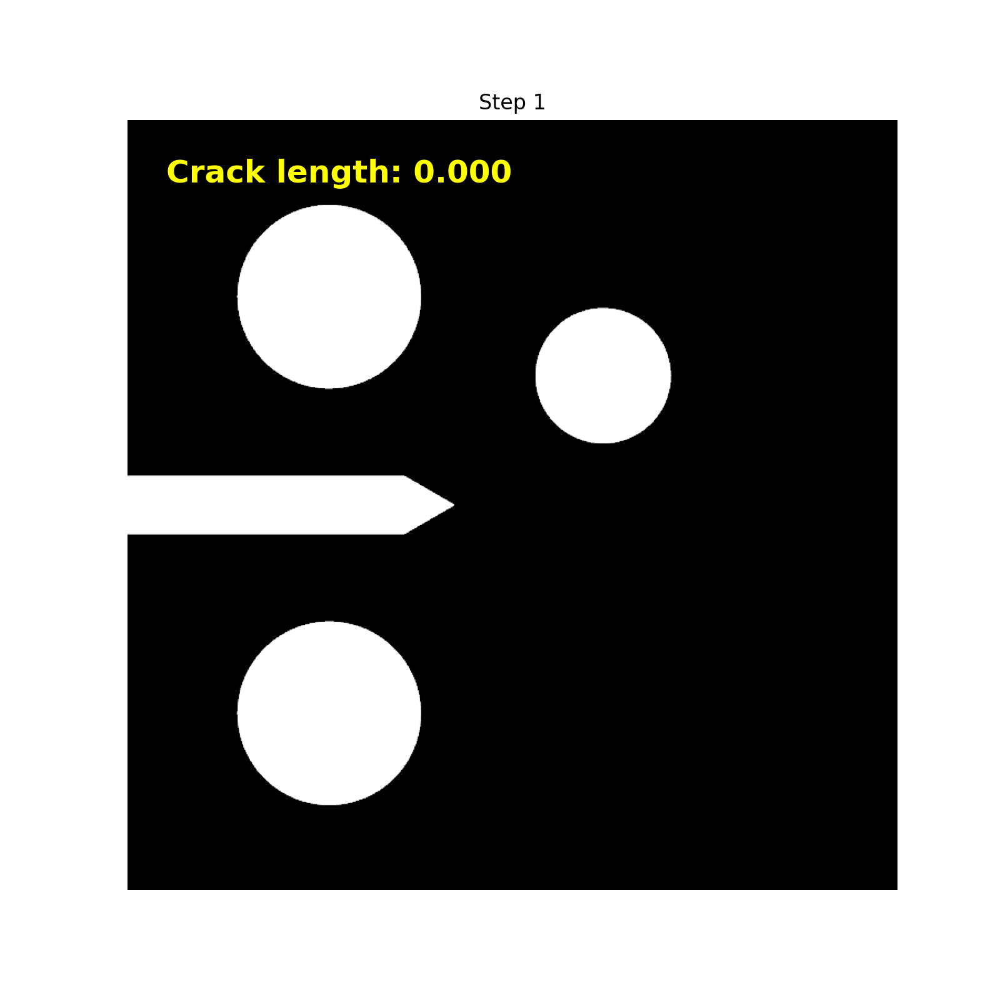

Crack Measurements
==================

The crack area obtained by directly integrating the $\gamma(\phi)$ function systematically overestimates the true crack area. 

Crack Length Measurement via Image Post-Processing and Skeletonization Algorithms
---------------------------------------------------------------------------------

The automated crack-length measurement workflow presented in :footcite:t:`Castillon2025_arxiv` is implemented using image post-processing and the skeletonization routines from scikit-image (:footcite:t:`code_skeleton_algorithm`, :footcite:t:`code_scikit_image`). The pipeline converts the phase-field variable into a binary mask, applies `skeletonize` to obtain a single-pixel-wide centerline, extracts pixel coordinates and maps them to physical domain coordinates, and fits a smooth spline to the centerline for accurate length measurement. The skeletonization algorithm iteratively thins object boundaries until the medial axis (the single-pixel-wide centerline) remains.

Below are the results of the simulations, for which we have images showing the crack evolution.

.. raw:: html

   

         

            

               
            

            

               
            

            

               
            

         

   

The algorithm extracts the line representing the crack path, saving for each frame a series of points that define the line. Once the line coordinates are known, the crack length can be computed from these points.

The animations below show the extracted line (for which all coordinates are known) for the results presented above. Note that the extracted line matches the crack obtained from the phase-field simulation very well, allowing the crack length to be computed with high accuracy.

.. raw:: html

   

         

            

               
            

            

               
            

            

               
            

         

   

Procedure
---------

The procedure automatically extracts and measures crack length from phase-field solutions stored in \texttt{.vtu} format through the following steps: (1) identification of cracked regions where $\phi > \phi_\text{th} = 0.95$; (2) generation of binary images with red zones indicating $\phi > \phi_\text{th}$ and black zones for $\phi < \phi_\text{th}$; (3) skeletonization to extract single-pixel-wide crack paths using \texttt{skimage.morphology.skeletonize}; (4) coordinate extraction from the single-pixel-wide path, where pixel coordinates are converted to real physical domain coordinates using the known pixel-to-domain mapping; (5) spline curve fitting to improve measurement accuracy by avoiding length mismeasurement that occurs when cracks follow diagonal paths; and (6) calculation of crack length from the fitted spline curves. Since the phase-field variable is not saved at every simulation step, quadratic interpolation is applied to obtain crack length at all time steps. Figure~\ref{fig:compact_specimen_with_holes_results} illustrates this procedure.

1. The crack is identified in regions where the phase-field variable $\phi$ exceeds a threshold value, defined as $\phi_{th} = 0.95$.

   Crack evolution over time (animated GIF).

2. Using this threshold, the crack area is extracted from the phase-field variable $\phi$. An image is then generated, highlighting regions where $\phi > \phi_{th}$ in one color and regions where $\phi < \phi_{th}$ in another.

   .. note::
      For the examples considered here, a rectangular domain is used. Therefore, the generated image will be a rectangle with the same size as the simulation domain. This allows for a direct mapping between image pixels and the physical dimensions of the domain, enabling accurate determination of the real coordinates of the crack in the images.

3. The skeleton of the crack is then extracted from the image. Skeletonization reduces the crack region to a single-pixel-wide path, representing the crack trajectory. This is accomplished using the `skimage.morphology.skeletonize` function and is performed for all time steps of the simulation. The underlying algorithm for skeletonization is explained in detail in the `scikit-image documentation <https://scikit-image.org/docs/0.25.x/auto_examples/edges/plot_skeleton.html>`_.
   
4. Since pixel-based measurements can introduce errors—especially where the crack path is diagonal or curved—the skeleton points are treated as coordinates, and a curve is fitted through these points to better approximate the actual crack path.
   
5. Finally, the length of the fitted curve is measured to obtain an accurate estimate of the crack length.

.. figure:: crack_evolution_pyvista.gif
   :align: center
   :width: 400

   Crack evolution over time (animated GIF).

.. footbibliography::
