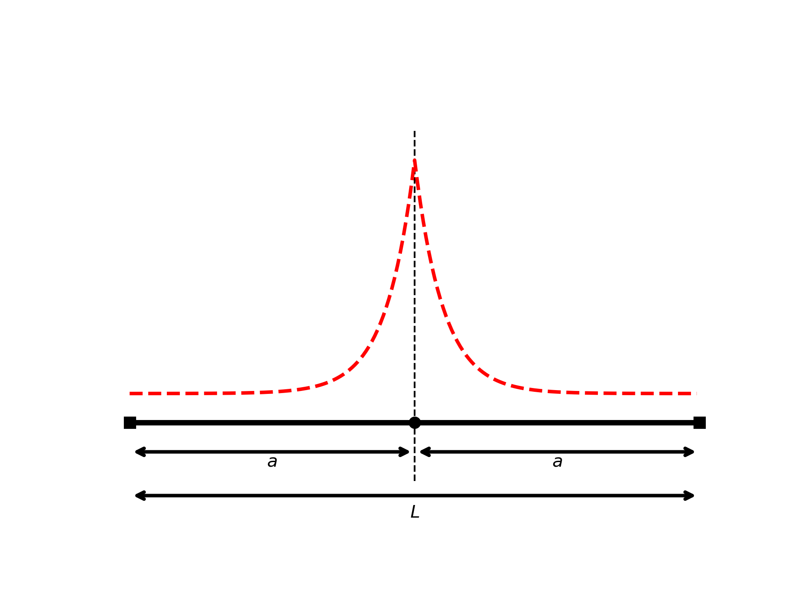
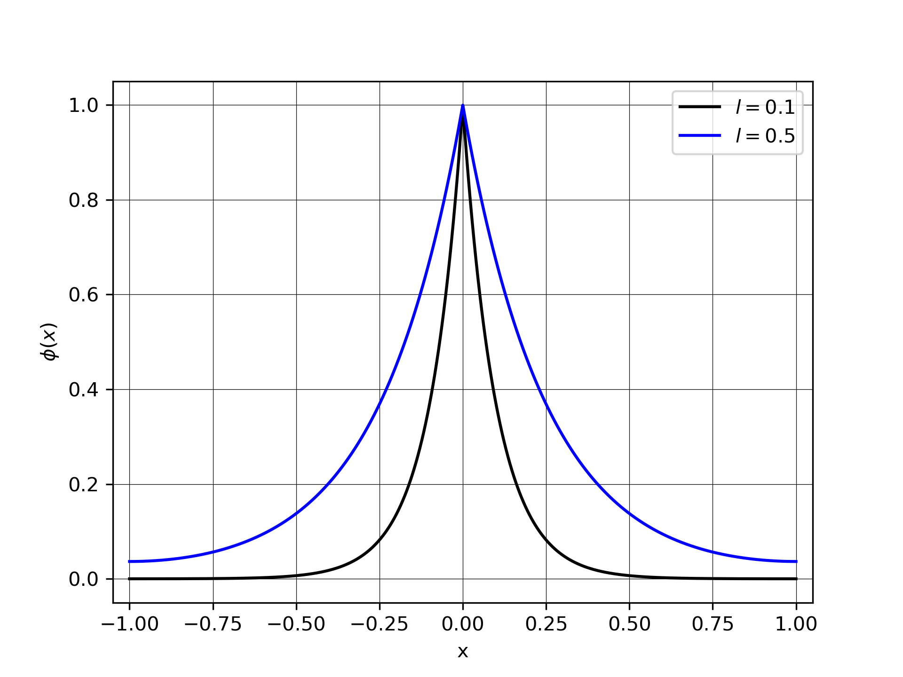
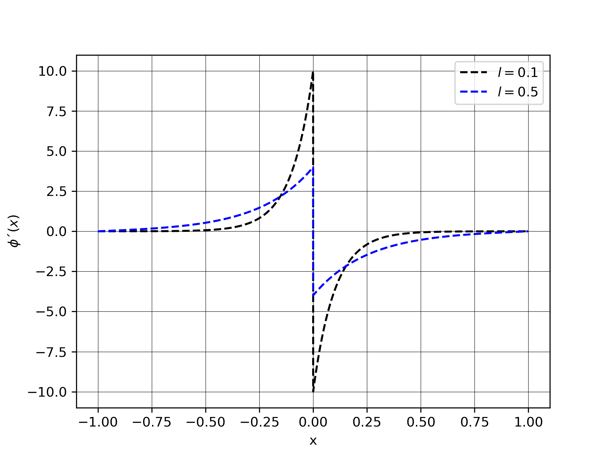
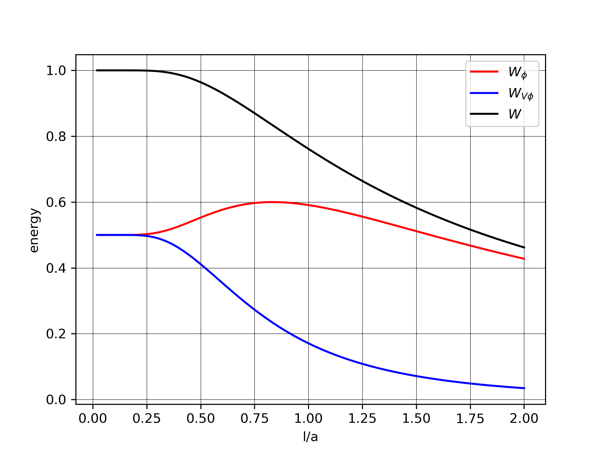
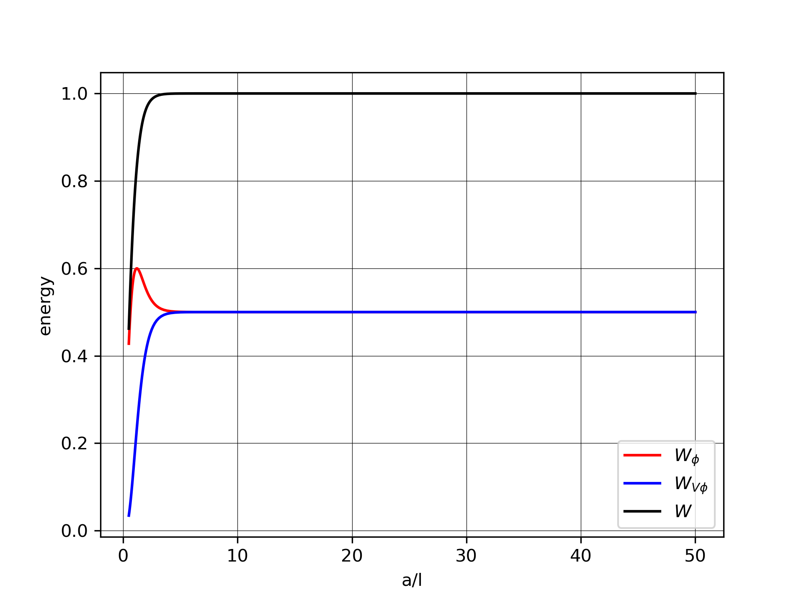

.. _theory_phase_field:

Crack Surface Density Functional
================================

Before studying the phase-field fracture simulation, which is a coupled problem of displacement (elasticity) and phase-field, it is recommended to understand each of the problems separately. In this case, the *crack surface density functional* will be studied alone, as described in [Miehe]_.

The aim of this functional is to provide a continuous representation of a discontinuous field. It should be noted that when the length scale parameter tends to 0, the continuous representation approximates the discontinuous case.

.. note::
    Please view the examples related to the crack surface density functional in :ref:`ref_examples_phase_field`.

  
Variational approach
--------------------
The problem that needs to be solved is stationary and derives from an optimization principle. 

The phase field is given by the minimizer of the crack surface density functional:

.. math::
	W[\phi] = \int_\Omega \left( \frac{1}{2l} \phi^2 + \frac{l}{2} |\nabla \phi|^2 \right) dV 

The equilibrium equations can be recovered from the optimality condition $\delta W = 0$.

Next, we calculate the variations of the functional by applying the Gateaux derivative:

.. math::
	\delta_\phi W & = \frac{d}{d \epsilon} W (\phi+\epsilon\delta_\phi) \bigg\rvert_{\epsilon=0}                                                                                                       \\
				  & = \frac{d}{d \epsilon} \int \left( \frac{1}{2l}(\phi+\epsilon\delta_\phi)^2 + \frac{l}{2} |\nabla (\phi+\epsilon\delta_\phi)|^2  \right) dV \bigg\rvert_{\epsilon=0}               \\
				  & = \int \left( \frac{1}{2l} 2(\phi+\epsilon\delta_\phi)\delta_\phi + \frac{l}{2} 2(\nabla (\phi+\epsilon\delta_\phi))\cdot \nabla \delta_\phi   \right) dV \bigg\rvert_{\epsilon=0} \\
				  & = \int \left( \frac{1}{l} (\phi+\epsilon\delta_\phi)\delta_\phi   +       l      (\nabla (\phi+\epsilon\delta_\phi))\cdot \nabla \delta_\phi   \right) dV \bigg\rvert_{\epsilon=0} \\
				  & = \int \left( \frac{1}{l} \phi \delta_\phi                        +       l       \nabla  \phi                      \cdot \nabla \delta_\phi  \right) dV

So, the weak form of the phase-field problem is given by:

.. math::
	\int_\Omega \left( \frac{1}{l} \phi \delta\phi  + l \nabla\phi \cdot \nabla \delta \phi \right) dV = 0

The strong form is given by:

.. math::
	\frac{1}{l}\phi - l \nabla^2 \phi = 0

and 

.. math::
	\nabla \phi \cdot \mathbf{n} = 0 \quad \text{on} \quad \partial \Omega

One dimension solution
----------------------

Consider a broken bar with length $L$, as depicted in fig |fig:bar_with_center_crack|, featuring a crack positioned at its center.

For the one-dimensional scenario, the functional reads:

.. math::
    W_{1D}[\phi] = \int_\Omega \left( \frac{1}{2l} \phi^2 + \frac{l}{2} \phi'^2 \right) dx
	
subject to the boundary conditions$\phi(0) = 1$, and $\phi'(\pm A) = 0$.

The problem can be reduced to a simple ordinary differential equation, with boundary conditions $\phi(0) = 1$, and $\phi'(A) = 0$:

.. math::
	\frac{1}{l}\phi(x) + l \phi''(x) = 0

The solution to this equation is given by:

.. math::
	\phi(x) = e^{-|x|/l} + \frac{1}{e^{\frac{2a}{l}}+1} 2 \sinh \left( \frac{|x|}{l} \right)

.. math::
	\nabla \phi(x) = \frac{-\text{sign}(x)}{l} e^{-|x|/l} + \frac{1}{e^{\frac{2a}{l}} +1} \frac{\text{sign}(x)}{l} 2 \cosh\left(\frac{|x|}{l}\right)

.. note::

    Note that [Miehe]_ considers an infinite domain (or infinite bar). Therefore, if $a/l \rightarrow \infty $, the solution coincides with that of Miehe, which means an infinite bar if $a \rightarrow \infty $, or equivalently, $l \rightarrow 0 $ for a finite bar. Thus, the solution of [Miehe]_ is recovered.

The phase field along the bar for two different length scales, $l=1.0$ and $l=0.5$, is shown in the following figure.

The corresponding gradients are also shown.

Energy
------

With the obtained solution, it is possible to calculate the energy values of the bar.
The energy functional can be written as:

.. math::
	W(\phi(x)) = \int_\Omega \left( \frac{1}{2l}\phi^2 + \frac{l}{2} \phi'^2 \right)dx

This energy can be separated into two contributions:

.. math::
	W_{\phi}(\phi(x)) = \int \frac{1}{2l}\phi(x)^2 dx

.. math::
	W_{\nabla \phi}(\phi(x)) = \int \frac{l}{2}\phi'(x)^2 dx

The total energy is then the sum of these contributions:

.. math::
	W(\phi(x)) = W_{\phi}(\phi(x)) + W_{\nabla \phi}(\phi(x))

Integrating over the one-dimensional domain, we find:

.. math::
	W_{\phi} = \frac{1}{2l} \int_{-a}^{a}   \left[ e^{-|x|/l} + \frac{1}{e^{\frac{2a}{l}}+1} 2 \sinh \left( \frac{|x|}{l} \right) \right]^2 dx 

.. math::
	W_{\nabla \phi}(\phi) = \frac{l}{2} \int_{-a}^{a}   \left[ \frac{-\text{sign}(x)}{l} e^{-|x|/l} + \frac{1}{e^{\frac{2a}{l}} +1} \frac{\text{sign}(x)}{l} 2 \cosh\left(\frac{|x|}{l}\right) \right]^2 dx

Therefore, the total energy is given by:

.. math::
	W = \tanh \left( \frac{a}{l} \right)

.. math::
	W_{\phi} = \frac{1}{2} \tanh \left( \frac{a}{l} \right) + \frac{1}{2} \frac{a}{l} \left[ 1-\tanh^2 \left( \frac{a}{l} \right) \right]

.. math::
	W_{\nabla \phi} = \frac{1}{2} \tanh \left( \frac{a}{l} \right) - \frac{1}{2} \frac{a}{l} \left[ 1-\tanh^2 \left( \frac{a}{l} \right) \right]

The following figure displays the energy of the bar for different values of the length scale $l/a$:

Additionally, the figure shows the energy versus the $a/l$ relation:

References
----------
.. [Miehe] A phase field model for rate-independent crack propagation: Robust algorithmic implementation based on operator splits, https://doi.org/10.1016/j.cma.2010.04.011.

Implementation
--------------