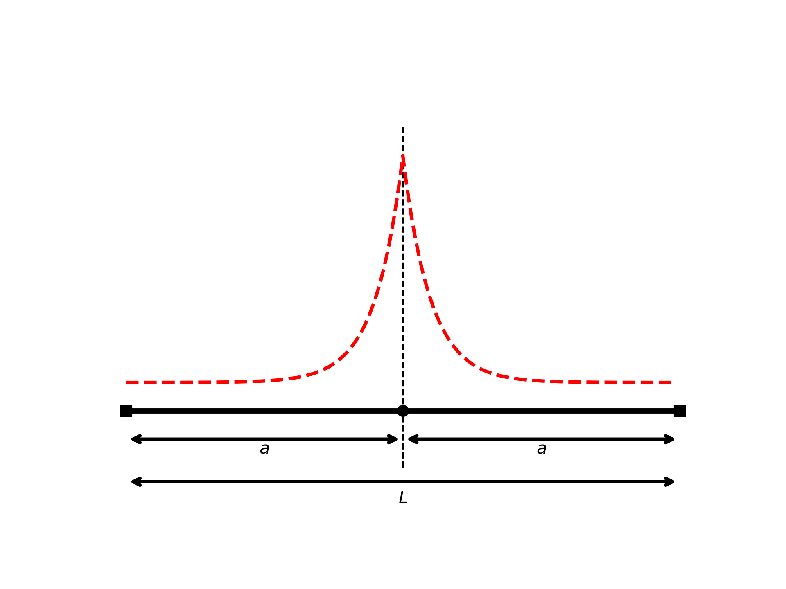

.. _theory_phase_field:

Crack Surface Density Functional
================================

Before studying phase-field fracture simulations—which couple elasticity and phase-field evolution—it is recommended to understand the phase-field regularization mechanism independently. Here, we focus on the **Crack Surface Density Functional** (CSDF), as introduced by :footcite:t:`phase_field_Bourdin2000` and :footcite:t:`phase_field_Miehe2010`.

The primary goal of the CSDF is to provide a continuous, regularized approximation of a sharp geometric crack surface $\Gamma_{\text{sharp}}$. As the length-scale parameter $l \to 0$, the continuous surface energy converges ($\Gamma$-convergence) to the discrete sharp crack surface area.

.. note::
    Please view the examples related to the crack surface density functional in :ref:`ref_examples_phase_field`.

Classic AT2 Variational Formulation
-----------------------------------

In the standard Ambrosio–Tortorelli type 2 (AT2) model, the phase-field variable $\phi \in [0, 1]$ describes the damage state (where $\phi = 0$ corresponds to intact material and $\phi = 1$ to fully broken material).

The crack surface density functional is defined as:

.. math::
   :label: eq_csdf_at2_functional

   \Gamma(\phi)_{\text{AT2}}[\phi] = \int_\Omega \gamma_{\text{AT2}}(\phi, \nabla\phi) \, \mathrm{d}\boldsymbol{x} = \int_\Omega \frac{1}{2} \left( \frac{1}{l} \phi^2 + l |\nabla \phi|^2 \right) \mathrm{d}\boldsymbol{x},

where $l$ is the length-scale parameter controlling the diffuse crack width.

The equilibrium state is given by the minimizer of this functional ($\delta \Gamma_{\text{AT2}} = 0$). Computing the Gateaux derivative with respect to an admissible variation $\delta\phi$:

.. math::
   :label: eq_csdf_at2_gateaux

   \Gamma'(\phi)_{\text{AT2}} = \int_\Omega \left( \frac{1}{l} \phi \, \delta\phi + l \nabla\phi \cdot \nabla \delta\phi \right) \mathrm{d}\boldsymbol{x} = 0.

This yields the weak form of the AT2 phase-field problem:

.. math::
   :label: eq_csdf_at2_weak_form

   \int_\Omega \left( \frac{1}{l} \phi \, \delta\phi + l \nabla\phi \cdot \nabla \delta\phi \right) \mathrm{d}\boldsymbol{x} = 0.

Integrating by parts gives the corresponding strong form PDE and Neumann boundary condition:

.. math::
   :label: eq_csdf_at2_strong_form

   \frac{1}{l}\phi - l \Delta \phi = 0 \quad \text{in } \Omega, \quad \text{with} \quad \nabla \phi \cdot \mathbf{n} = 0 \quad \text{on } \partial \Omega.

General Formulation of the CSDF
-------------------------------

The classical AT2 model can be generalized to a broader family of regularizations :footcite:p:`phase_field_Wu, phase_field_modeling_of_fracture`. The general Crack Surface Density Functional is defined as:

.. math::
   :label: eq_csdf_general_functional

   \Gamma(\phi) = \int_\Omega \gamma(\phi, \nabla\phi) \, \mathrm{d}\boldsymbol{x} = \int_\Omega \frac{1}{c_0} \left( \frac{\alpha(\phi)}{l} + l |\nabla \phi|^2 \right) \mathrm{d}\boldsymbol{x},

where $\alpha(\phi)$ is the geometric crack function satisfying $\alpha(0) = 0$ and $\alpha(1) = 1$, and $c_0$ is a dimensionless normalization constant defined as:

.. math::
   :label: eq_csdf_c0_constant

   c_0 := 4 \int_0^1 \sqrt{\alpha(\eta)} \, \mathrm{d}\eta.

This normalization ensures that $\Gamma(\phi)$ recovers the exact sharp crack surface energy in the limit $l \to 0$.

The functional can be naturally split into two energetic contributions—the phase-field local energy $\Gamma_\phi$ and the gradient energy $\Gamma_{\nabla\phi}$:

.. math::
   :label: eq_csdf_energy_split

   \Gamma_\phi(\phi) := \frac{1}{c_0} \int_\Omega \frac{\alpha(\phi)}{l} \, \mathrm{d}\boldsymbol{x}, \quad
   \Gamma_{\nabla \phi}(\phi) := \frac{1}{c_0} \int_\Omega l |\nabla \phi|^2 \, \mathrm{d}\boldsymbol{x}, \quad \text{such that} \quad
   \Gamma(\phi) = \Gamma_\phi(\phi) + \Gamma_{\nabla\phi}(\phi).

Enforcing stationarity ($\delta\Gamma = 0$) leads to the general weak form:

.. math::
   :label: eq_csdf_general_weak_form

   \Gamma'(\phi) = \int_\Omega \frac{1}{c_0} \left( \frac{\alpha'(\phi)}{l} \delta\phi + 2l \nabla\phi \cdot \nabla\delta\phi \right) \mathrm{d}\boldsymbol{x} = 0.

The corresponding strong form PDE and boundary conditions read:

.. math::
   :label: eq_csdf_general_strong_form

   \frac{1}{c_0}\left( \frac{\alpha'(\phi)}{l} - 2 l \Delta \phi \right) = 0 \quad \text{in } \Omega, \quad \text{with} \quad \nabla \phi \cdot \boldsymbol{n} = 0 \quad \text{on } \partial \Omega.

Specific CSDF Regularization Models
~~~~~~~~~~~~~~~~~~~~~~~~~~~~~~~~~~~

Different choices of the geometric function $\alpha(\phi)$ define distinct regularization models. The most widely used formulations in the literature include:

1. **AT2 Model** (Ambrosio–Tortorelli type 2) :footcite:p:`phase_field_Bourdin2000`:
   quadratic function $\alpha(\phi) = \phi^2$, giving $\alpha'(\phi) = 2\phi$ and $c_0 = 2$.
2. **AT1 Model** (Ambrosio–Tortorelli type 1) :footcite:p:`introduction_ambrosio_tortorelli`:
   linear function $\alpha(\phi) = \phi$, giving $\alpha'(\phi) = 1$ and $c_0 = 8/3$.
3. **Wu Model** :footcite:p:`phase_field_Wu`:
   rational/polynomial function $\alpha(\phi) = 2\phi - \phi^2$, giving $\alpha'(\phi) = 2 - 2\phi$ and $c_0 = \pi$.
4. **Double-Well Potential Model**:
   quartic double-well potential $\alpha(\phi) = 16\phi^2(1-\phi)^2$, giving $\alpha'(\phi) = 32\phi(1-\phi)(1-2\phi)$ and $c_0 = 8/3$.

.. _tab_csdf_models_summary:
.. list-table:: Summary of geometric crack functions $\alpha(\phi)$, derivatives $\alpha'(\phi)$, and normalization constants $c_0$.
   :header-rows: 1

   * - **Model**
     - **Geometric Function** $\alpha(\phi)$
     - **Derivative** $\alpha'(\phi)$
     - **Constant** $c_0$
   * - **AT2**
     - $\phi^2$
     - $2\phi$
     - $2$
   * - **AT1**
     - $\phi$
     - $1$
     - $8/3 \approx 2.667$
   * - **Wu**
     - $2\phi - \phi^2$
     - $2 - 2\phi$
     - $\pi \approx 3.1416$
   * - **Double-Well**
     - $16\phi^2 (1-\phi)^2$
     - $32\phi(1-\phi)(1-2\phi)$
     - $8/3 \approx 2.667$

.. grid:: 2

   .. grid-item::

      .. figure:: images/geometric_functions_at1_at2_wu.png
         :width: 100%

         Isotropic model

   .. grid-item::

      .. figure:: images/geometric_function_double_well.png
         :width: 100%

         Anisotropic model

Interval Constraints and Physical Boundedness
~~~~~~~~~~~~~~~~~~~~~~~~~~~~~~~~~~~~~~~~~~~~~

For the phase-field variable to remain physically admissible, it must satisfy the interval constraint $\phi \in [0, 1]$.

- **Lower Bound ($\phi \ge 0$):**
  The **AT2 model** naturally satisfies $\phi \ge 0$ because its geometric function $\alpha(\phi) = \phi^2$ has a global minimum at $\phi = 0$.
  In contrast, the **AT1** and **Wu** models have non-zero derivatives at $\phi = 0$ ($\alpha'(0) = 1$ for AT1, $\alpha'(0) = 2$ for Wu). Without explicit enforcement of $\phi \ge 0$, unconstrained minimization can drive $\phi$ into negative values.

- **Upper Bound ($\phi \le 1$):**

Analytical solution of the one-dimensional problem
^^^^^^^^^^^^^^^^^^^^^^^^^^^^^^^^^^^^^^^^^^^^^^^^^^

An analytical study of the CSDF is conducted to examine the implications of the interval constraints and compare the regularizations. Consider a one-dimensional bar of length $2a$ ($x \in [-a, a]$) with a central crack ($\phi(0) = 1$) and Neumann boundary conditions $\phi'(\pm a) = 0$.

   One-dimensional bar with a central crack.

The 1D governing ordinary differential equation (ODE) subject to $0 \le \phi(x) \le 1$ reads:

.. math::
   :label: eq_pff_csdf_1d_ode

   \frac{1}{c_0} \left( \frac{\alpha'(\phi(x))}{l} - 2l \phi''(x) \right) = 0 \quad \text{in } [-a, a], \quad \text{with } \phi(0)=1, \; \phi'(a)=0.

Model-Specific 1D ODEs:

.. math::
   :label: eq_pff_1d_odes_models

   \text{AT2:} \quad \frac{\phi(x)}{l} - l \phi''(x) = 0, \quad
   \text{AT1:} \quad \frac{1}{2l} - l \phi''(x) = 0, \quad
   \text{Wu:} \quad \frac{1}{l}(1-\phi(x)) - l \phi''(x) = 0.

Closed-Form Solutions $\phi(x)$ and $\phi'(x)$:

- **AT2 Model Solution** (Infinite Support):

  .. math::
     :label: eq_pff_at2_phi_solution

     \phi_{\text{AT2}}(x) = e^{-\frac{|x|}{l}} + \frac{2\sinh\left(\frac{|x|}{l}\right)}{e^{2a/l}+1}.

- **AT1 Model Solution** (Compact Support for $a \ge 2l$):

  .. math::
     :label: eq_pff_at1_phi_solution

     \phi_{\text{AT1}}(x) = \begin{cases} 
         1 - \frac{a|x|}{2l^2} + \frac{x^2}{4l^2} & \text{if } a < 2l, \\
         \left(1 - \frac{|x|}{2l}\right)^2 & \text{if } a \ge 2l \text{ and } |x| < 2l, \\
         0 & \text{if } a \ge 2l \text{ and } |x| \ge 2l.
     \end{cases}

  .. math::
     :label: eq_pff_at1_phip_solution

     \phi'_{\text{AT1}}(x) = \begin{cases} 
         \frac{x}{2l^2} - \frac{a \,\mathrm{sgn}(x)}{2l^2} & \text{if } a < 2l, \\
         \frac{x}{2l^2} - \frac{\mathrm{sgn}(x)}{l} & \text{if } a \ge 2l \text{ and } |x| < 2l, \\
         0 & \text{if } a \ge 2l \text{ and } |x| \ge 2l.
     \end{cases}

- **Wu Model Solution** (Compact Support for $a \ge \frac{\pi l}{2}$):

  .. math::
     :label: eq_pff_wu_phi_solution

     \phi_{\text{Wu}}(x) = \begin{cases} 
         1 & \text{if } a < \frac{\pi l}{2}, \\
         1 - \sin\left(\frac{|x|}{l}\right) & \text{if } a \ge \frac{\pi l}{2} \text{ and } |x| < \frac{\pi l}{2}, \\
         0 & \text{if } a \ge \frac{\pi l}{2} \text{ and } |x| \ge \frac{\pi l}{2}.
     \end{cases}

  .. math::
     :label: eq_pff_wu_phip_solution

     \phi'_{\text{Wu}}(x) = \begin{cases} 
         0 & \text{if } a < \frac{\pi l}{2}, \\
         -\frac{\mathrm{sgn}(x)}{l}\cos\left(\frac{|x|}{l}\right) & \text{if } a \ge \frac{\pi l}{2} \text{ and } |x| < \frac{\pi l}{2}, \\
         0 & \text{if } a \ge \frac{\pi l}{2} \text{ and } |x| \ge \frac{\pi l}{2}.
     \end{cases}

Closed-Form Energy Expressions:

- **AT1 Energies:**

  .. math::
     :label: eq_pff_at1_energy_expressions

     \Gamma_{\text{AT1}} = \begin{cases} \frac{3a}{4l} - \frac{a^3}{16 l^3} & \text{if } a < 2l, \\ 1 & \text{if } a \ge 2l, \end{cases} \quad
     \Gamma_{\phi, \text{AT1}} = \begin{cases} \frac{3a}{4l} - \frac{a^3}{8 l^3} & \text{if } a < 2l, \\ 1/2 & \text{if } a \ge 2l, \end{cases} \quad
     \Gamma_{\nabla \phi, \text{AT1}} = \begin{cases} \frac{a^3}{16 l^3} & \text{if } a < 2l, \\ 1/2 & \text{if } a \ge 2l. \end{cases}

- **Wu Energies:**

  .. math::
     :label: eq_pff_wu_energy_expressions

     \Gamma_{\text{Wu}} = \begin{cases} \frac{2a}{\pi l} & \text{if } a < \frac{\pi l}{2}, \\ 1 & \text{if } a \ge \frac{\pi l}{2}, \end{cases} \quad
     \Gamma_{\phi, \text{Wu}} = \begin{cases} \frac{2a}{\pi l} & \text{if } a < \frac{\pi l}{2}, \\ 1/2 & \text{if } a \ge \frac{\pi l}{2}, \end{cases} \quad
     \Gamma_{\nabla \phi, \text{Wu}} = \begin{cases} 0 & \text{if } a < \frac{\pi l}{2}, \\ 1/2 & \text{if } a \ge \frac{\pi l}{2}. \end{cases}

.. _tab_pff_analytical_solutions:
.. list-table:: Analytical solutions $\phi(x)$ for AT2, AT1, and Wu models ($H(\cdot)$ denotes the Heaviside step function).
   :header-rows: 1

   * - **Model**
     - **Phase-Field Profile** $\phi(x)$
   * - **AT2**
     - $e^{-\frac{|x|}{l}} + \frac{2\sinh\left(\frac{|x|}{l}\right)}{e^{2a/l}+1}$
   * - **AT1**
     - $\left(\frac{x^2}{4l^2} - \frac{|x|}{l} + 1\right) H(2l-|x|) + \left[1-\frac{a}{2l}\right]\frac{|x|}{l} H(2l-a)$
   * - **Wu**
     - $1-\sin\left(\frac{|x|}{l}\right) H\left(\frac{\pi l}{2}-|x|\right) H\left(a-\frac{\pi l}{2}\right)$

.. _tab_pff_analytical_energies:
.. list-table:: Analytical energy expressions $\Gamma_\phi$ and $\Gamma_{\nabla\phi}$ for AT2, AT1, and Wu models.
   :header-rows: 1

   * - **Model**
     - **Phase-Field Energy** $\Gamma_{\phi}$
     - **Gradient Energy** $\Gamma_{\nabla \phi}$
   * - **AT2**
     - $\frac{1}{2} \tanh\left(\frac{a}{l}\right) + \frac{1}{2} \frac{a}{l} \left[1-\tanh^2\left(\frac{a}{l}\right)\right]$
     - $\frac{1}{2} \tanh\left(\frac{a}{l}\right) - \frac{1}{2} \frac{a}{l} \left[1-\tanh^2\left(\frac{a}{l}\right)\right]$
   * - **AT1**
     - $\frac{1}{2} H(a-2l) + H(2l-a)\left(\frac{-a^3}{8 l^3} + \frac{3a}{4l}\right)$
     - $\frac{1}{2} H(a-2l) + H(2l-a) \frac{a^3}{16 l^3}$
   * - **Wu**
     - $\frac{1}{2} H(a-l\pi/2) + H(l\pi/2 - a)\frac{2a}{\pi l}$
     - $\frac{1}{2} H(a-l\pi/2)$

.. grid:: 1

   .. grid-item::

      .. figure:: images/compare_phi_profiles.png
         :width: 100%

         Analytical phase-field profiles $\phi(x)$ for $l/a = 0.1$.

   .. grid-item::

      .. figure:: images/compare_gradphi_profiles.png
         :width: 100%

         Analytical phase-field gradients $\nabla\phi(x)$ for $l/a = 0.1$.

The AT1 and Wu models exhibit **compact support** when $l$ is sufficiently small relative to domain size $a$, vanishing identically beyond $x = 2l$ (AT1) or $x = \pi l/2$ (Wu). Consequently, their total surface energy exactly equals the sharp crack energy ($\Gamma = 1.0$) without boundary residuals. In contrast, the AT2 model has infinite exponential support and approaches $\Gamma = 1.0$ asymptotically as $a/l \to \infty$.

.. _tab_pff_sharp_crack_conditions:
.. list-table:: Domain conditions for the 1D surface energy to equal the exact sharp crack energy ($\Gamma = 1$).
   :header-rows: 1

   * - **Model**
     - **Condition for** $\Gamma = 1$
   * - **AT2**
     - $a/l \to \infty$ (Asymptotic: $a/l \ge 5 \implies \text{error} < 0.1\%$)
   * - **AT1**
     - $a/l \ge 2$
   * - **Wu**
     - $a/l \ge \pi/2 \approx 1.571$

.. footbibliography::