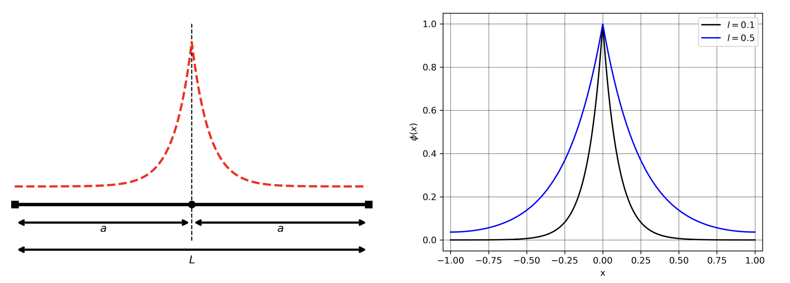
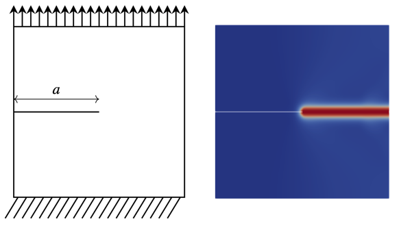
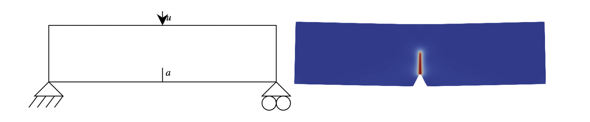

# Summary

The **PhaseFieldX** project is designed to simulate and analyze material behavior using phase-field models, which provide a continuous approximation for interfaces, phase boundaries, and discontinuities such as cracks. Leveraging the robust capabilities of *FEniCSx* [@BarattaEtal2023; @ScroggsEtal2022; @BasixJoss; @AlnaesEtal2014], a renowned finite element framework for solving partial differential equations, this project enables efficient and accurate numerical simulations related to phase-field models. It supports a broad range of applications, including phase-field fracture, solidification, and other complex material phenomena, making it an invaluable resource for researchers and engineers in materials science.

{height="100pt"}

- **Phase-Field Fracture**:

The phase-field fracture model was extended by @Miehe2010 to incorporate a regularized crack field within the variational framework of Griffith’s fracture theory, as developed by @FrancfortMarigo1998. This model provides a robust and versatile approach for simulating fracture and material failure, representing cracks implicitly through a continuous phase-field variable rather than requiring explicit crack tracking. This implicit representation simplifies numerical implementation and naturally enables the simulation of complex crack patterns, including branching, merging, and interactions among multiple cracks.

A diffuse variable, the “phase-field” $\phi$, distinguishes between intact ($\phi = 0$) and fractured ($\phi = 1$) regions, with a smooth transition between them. This setup allows cracks to evolve based on energy minimization principles, eliminating the need for explicit crack-path tracking. The functional is given by \autoref{eq:phase_field_fracture_functional},
\begin{equation}\label{eq:phase_field_fracture_functional}
\mathcal{E}(\boldsymbol u, \phi) = \int_\Omega g(\phi)  \psi(\epsilon(\boldsymbol u)) \mathrm{d}\Omega + G_c \int_\Omega \left( \frac{1}{2l}\phi^2 + \frac{l}{2} |\nabla \phi|^2 \right) \mathrm{d}\Omega - \mathcal{E}_{\text{ext}}[\boldsymbol u].
\end{equation}
where $\phi$ is the phase-field variable, $\boldsymbol u$ is the displacement vector field, $g(\phi) = (1 - \phi)^2$ is the degradation function that reduces material stiffness as damage progresses, $\epsilon(\boldsymbol u)= \frac{1}{2} \left( \nabla \boldsymbol u + \nabla^T \boldsymbol u \right)$ is the small strain tensor, $\psi(\epsilon(\boldsymbol u)) = \frac{1}{2}\lambda tr^2(\epsilon(\boldsymbol u)) + \mu tr(\epsilon(\boldsymbol u)^2)$ is the strain energy, $G_c$ is the critical energy release rate, $l$ is the length scale parameter that controls the width of the diffuse crack region and $\mathcal{E}_{\text{ext}}[\boldsymbol u] = \int_\Omega f \cdot \boldsymbol u \, \mathrm{d}\Omega + \int_{\partial \Omega} t \cdot \boldsymbol u \, \mathrm{d}S$ represents the external terms, with $f$ being the prescribed volume force in $\Omega$ and $t$ the surface traction force on $\partial \Omega$.

The energy can be split into two components $\psi(\epsilon(\boldsymbol u)) = \psi_a(\epsilon(\boldsymbol u)) + \psi_b(\epsilon(\boldsymbol u))$, where $\psi_a$ represents the energy associated with tensile stresses capable of generating fractures, and the degradation function is applied only to this component. This yields the form $g(\phi) \psi_a(\epsilon(\boldsymbol u)) + \psi_b(\epsilon(\boldsymbol u))$, preventing crack formation due to compressive forces. Various methods exist for performing this energy split, such as the spectral decomposition [@Miehe2010] and the volumetric-deviatoric decomposition [@Amor2009]. Models that incorporate this energy split are known as anisotropic models, while models without energy splitting are referred to as isotropic models.

To enforce crack irreversibility, @Miehe2010 introduces a history field, defined as the maximum reference energy obtained throughout the material’s history, which drives the phase field. As a result, this variable will always increase, ensuring that cracks cannot heal.

- **Phase-Field Fatigue**:

Following @Carrara2020, fatigue effects can be modeled by introducing a fatigue degradation function, $f(\bar{\alpha}(t))$, which reduces fracture toughness based on a cumulative history variable, $\bar{\alpha}(t)$, where $t$ represents a pseudotime in the simulation setup. This new history variable, can be any scalar quantity that effectively captures the material’s fatigue history. The functional, in the absence of external terms, is given by \autoref{eq:phase_field_fatigue_functional}.
\begin{equation}\label{eq:phase_field_fatigue_functional}
\mathcal{E}(\boldsymbol u, \phi) = \int_\Omega g(\phi) \psi(\epsilon(\boldsymbol u)) \mathrm{d}\Omega + f(\bar{\alpha}(t)) G_c \int_\Omega \left( \frac{1}{2l}\phi^2 + \frac{l}{2} |\nabla \phi|^2 \right)  \mathrm{d}\Omega.
\end{equation}
Note that multiple types of fatigue degradation functions have been developed [@Carrara2020], along with various methods for accumulating the cumulative history variable.

- **Crack surface density functional**:

One of the key aspects of phase-field fracture simulations is that the crack surface density functional provides a continuous approximation of cracks, which converges to a discrete crack representation as the length scale parameter approaches zero. This corresponds to the second part of the phase-field fracture functional, as given in \autoref{eq:phase_field_fracture_functional}. Therefore, before studying phase-field fracture models, it is recommended to first focus on this part of the functional in isolation.

The second part of the functional, which governs the regularization of the phase-field, is presented in \autoref{eq:crack_representation_functional}.
\begin{equation}\label{eq:crack_representation_functional}
W[\phi] = \int_\Omega \left( \frac{1}{2l} \phi^2 + \frac{l}{2} |\nabla \phi|^2 \right) \mathrm{d}\Omega
\end{equation}

By considering this, an analytical solution can be derived for a one-dimensional problem, where a cracked bar of length $2a$ is represented by the phase-field, as shown in \autoref{fig:bar_one_dimension_solution}. Considering the conditions of $\phi(0)=1$  and  $\phi'(\pm a)=0$ the solution is given by \autoref{eq:one_dimensional_solution},
\begin{equation}\label{eq:one_dimensional_solution}
\phi(x) = e^{-|x|/l} + \frac{2}{e^{\frac{2a}{l}}+1} \sinh \left( \frac{|x|}{l} \right)
\end{equation}
where $l$ is the length scale parameter and $a$ is half the length of the bar. In the limiting case where $l \to 0$, it follows that $a/l \to \infty$, and the phase-field is represented solely by the $e^{-|x|/l}$ term. The total energy of the bar is given by $W=\tanh(a/l)$, and in the limit case as $l \to 0$, $W$ approaches $1$.

Note that as the length scale parameter tends to zero, the continuous phase-field representation converges to a discrete crack representation. \autoref{fig:bar_one_dimension_solution} illustrates the crack approximation for a bar of length $2a$ (with $a=1$), for two different length-scale values.

{width="360pt"}

- **Other Phase-Field Models**:

Although the main capabilities of **PhaseFieldX** focus on fracture, fatigue, crack surface density functional, and elasticity problems, this framework also allows for the study of other phase-field models. Currently, the *Allen-Cahn* equation is included, enabling simulations of phase transformations and other diffuse-interface phenomena.

# Statement of Need

**PhaseFieldX** distinguishes itself as a leading open-source package for phase-field modeling, particularly in the absence of commercial solutions that directly support phase-field fracture simulations. The primary alternatives include the use of *ABAQUS* subroutines, which require users to develop custom code, or open-source codes such as *RACCOON* [@RACCOON], a parallel finite-element framework specialized in phase-field fracture simulations. 

Other platforms, such as the open-source *FEniCS* or *COMSOL*, offer some implementations of the phase-field model. However, to the best of the author's knowledge, these implementations are often tailored to specific problems and are limited in scope for general phase-field modeling. Beyond fracture or fatigue simulations, other noteworthy software packages include *SymPhas* [@SymPhas], a general-purpose platform for phase-field, phase-field crystal, and reaction-diffusion simulations; *OpenPhase* [@OpenPhase], which enables three-dimensional simulation of microstructural evolution using the multiphase field method; and *PRISMS-PF* [@PRISMS-PF], a general framework for phase-field modeling that employs a matrix-free finite-element method.

**PhaseFieldX** integrates the latest advancements in phase-field research, offering fatigue simulation capabilities in a user-friendly, ready-to-use package. By simplifying access to cutting-edge methods, it lowers barriers to adoption and enables researchers to focus on scientific discovery without the challenges of bespoke modeling.

The platform’s modular design empowers users to customize parameters such as degradation functions, energy-splitting schemes, and solver strategies, allowing a wide range of configurations for phase-field fracture and fatigue studies. This flexibility encourages innovation and experimentation, making **PhaseFieldX** an ideal tool for reliable simulations and collaborative development. Researchers can contribute to its evolution, creating a dynamic ecosystem that advances understanding of complex material behaviors and drives scientific progress.

# Applications

**PhaseFieldX** offers a comprehensive range of applications in materials science and engineering. For phase-field fracture simulations, it supports various degradation functions and energy split methods, such as the volumetric-deviatoric split [@Amor2009] and spectral decomposition [@Miehe2010]. The framework accommodates multiple formulations, including isotropic, anisotropic, and hybrid approaches [@Ambati2015]. For example, two well-known simulations from @Miehe2010 can be conducted through **PhaseFieldX**, specifically using an anisotropic formulation with spectral energy decomposition.

The first example, a single-edge notched tension test, consists of a square plate with a centrally located notch extending from the left edge, as illustrated in \autoref{fig:example_sentt}. The lower edge of the plate is fully constrained, while the upper edge is free to slide vertically. A vertical displacement is applied to the top until the crack propagates. The final phase-field values displayed in \autoref{fig:example_sentt}.

{width="280pt"}

The second example, known as the three-point bending test, involves a rectangular plate with a centrally located notch and is supported at both ends, as shown in \autoref{fig:example_three_point}. Small surface in the lower left corner is fixed in all directions, while another small surface in the lower right corner is constrained in the vertical direction.A vertical, downward displacement is applied to a small surface at the center of the top edge until the crack propagates. The final phase-field values displayed in \autoref{fig:example_sentt}.

{width="360pt"}

**PhaseFieldX** also enables fatigue analysis by applying cyclic loading, allowing the simulation of crack propagation as the cycle count increases. Additionally, the platform facilitates studies of other phase-field models, such as the Allen-Cahn equation, broadening its application to various phase transformation phenomena.

These capabilities make **PhaseFieldX** a versatile and powerful tool for researchers and engineers investigating complex material behaviors through advanced phase-field simulations. A comprehensive list of examples is available, demonstrating the breadth of possible applications and scenarios.

# Acknowledgements

This work was supported by the FPI grant PRE2020-092051, funded by MCIN/AEI /10.13039/501100011033.

# References
